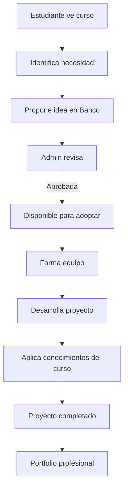

<!-- _class: lead -->
# ISC-ITCM Cursos
## Plataforma de Cursos en Línea

**Educación Digital ISC**
Instituto Tecnológico de Ciudad Madero

**Jesús Olvera**
© 2025

---

## 📋 Descripción General

Plataforma de cursos en línea de Ingeniería en Sistemas Computacionales del ITCM con videos, tutoriales y recursos organizados por materia.

**Misión:**
Proporcionar acceso centralizado a contenido educativo de calidad, organizado por semestre y materia, facilitando el aprendizaje autónomo y colaborativo.

**URL:** [https://jjho05.github.io/ISC-ITCM-CURSOS](https://jjho05.github.io/ISC-ITCM-CURSOS)

---

## 🎯 Objetivos de la Plataforma

### Educativos
- ✅ **Centralizar contenido** de 9 semestres
- ✅ **Facilitar aprendizaje** autónomo
- ✅ **Complementar clases** presenciales
- ✅ **Preservar conocimiento** institucional

### Técnicos
- ✅ Organización por unidades y temas
- ✅ Videos embebidos de YouTube
- ✅ Tutoriales técnicos especializados
- ✅ Sistema de Q&A por curso

---

## 🏗️ Arquitectura del Sistema

```
ISC-ITCM-CURSOS/
├── Páginas Principales
│   ├── index.html              # Landing page
│   ├── plan-de-estudios.html   # Catálogo de cursos
│   └── tutoriales.html         # Catálogo de tutoriales
│
├── Cursos por Semestre
│   ├── semestre1/              # Fundamentos
│   ├── semestre2/              # POO, Cálculo
│   ├── semestre3/              # Estructuras
│   ├── semestre4/              # TAP, BD
│   ├── semestre5/              # Graficación, SO
│   ├── semestre6/              # Lenguajes, Redes
│   ├── semestre7/              # Lenguajes II, GPS
│   ├── semestre8/              # Programación Web
│   └── semestre9/              # IA
│
├── Tutoriales Técnicos
│   ├── monday.html             # Gestión de proyectos
│   ├── git.html                # Control de versiones
│   └── [más tutoriales]        # Docker, React, etc.
│
└── Banco de Ideas
    └── [sistema completo]      # Proponer proyectos
```

---

## 🛠️ Stack Tecnológico

### Frontend
- **HTML5** - Estructura semántica
- **CSS3** - Estilos personalizados
- **Tailwind CSS** - Framework de utilidades (CDN)
- **JavaScript** - Interactividad

### Integración de Videos
- **YouTube API** - Videos embebidos
- **Responsive iframes** - Adaptación a dispositivos
- **Lazy loading** - Carga optimizada

### Backend
- **FormSubmit.co** - Notificaciones
- **GitHub Pages** - Hosting
- **JSON** - Configuración de videos

---

## 📚 Sistema de Cursos

### Organización Académica

**9 Semestres Completos:**
- Total de materias: 50+
- Videos organizados por unidad
- Recursos complementarios
- Sistema Q&A integrado

**Estructura por Curso:**
```
Curso/
├── Información general
├── Competencias a desarrollar
├── Videos por unidad
│   ├── Unidad 1
│   ├── Unidad 2
│   └── ...
├── Recursos adicionales
└── Sección de preguntas
```

---

## 📚 Cursos por Semestre

### Semestre 1 - Fundamentos
- Fundamentos de Programación
- Cálculo Diferencial
- Matemáticas Discretas
- Taller de Ética
- Fundamentos de Investigación

### Semestre 2 - POO y Matemáticas
- Programación Orientada a Objetos
- Cálculo Integral
- Álgebra Lineal
- Probabilidad y Estadística
- Química

---

## 📚 Cursos por Semestre (continuación)

### Semestre 3 - Estructuras
- Estructura de Datos
- Cálculo Vectorial
- Física General
- Cultura Empresarial
- Desarrollo Sustentable

### Semestre 4 - Avanzado
- Tópicos Avanzados de Programación
- Bases de Datos
- Ecuaciones Diferenciales
- Métodos Numéricos
- Fundamentos de Telecomunicaciones

---

## 📚 Cursos por Semestre (continuación)

### Semestre 5 - Sistemas
- Graficación
- Telecomunicaciones
- Sistemas Operativos
- Fundamentos de Ingeniería de Software
- Arquitectura de Computadoras

### Semestre 6 - Redes y Software
- Lenguajes y Autómatas I
- Redes de Computadoras
- Ingeniería de Software
- Administración de Bases de Datos
- Contabilidad Financiera

---

## 📚 Cursos por Semestre (continuación)

### Semestre 7 - Gestión
- Lenguajes y Autómatas II
- Gestión de Proyectos de Software
- Conmutación y Enrutamiento
- Taller de Investigación I
- Programación Móvil

### Semestre 8 - Web y Lógica
- Programación Lógica y Funcional
- Programación Web
- Taller de Investigación II
- Especialidad I

---

## 📚 Cursos por Semestre (continuación)

### Semestre 9 - Especialización
- Inteligencia Artificial
- Especialidad II
- Especialidad III
- Residencia Profesional

---

## 🎓 Sistema de Videos

### Configuración JSON

```javascript
const videosMateria = {
    "SCD1008": {
        nombre: "Fundamentos de Programación",
        videos: {
            "1.1": "ID_VIDEO_YOUTUBE",
            "1.2": "ID_VIDEO_YOUTUBE",
            "2.1": "ID_VIDEO_YOUTUBE",
            // ...
        }
    }
};
```

### Características
- ✅ IDs de YouTube organizados
- ✅ Fácil actualización
- ✅ Escalable
- ✅ Mantenimiento simple

---

## 🎓 Interfaz de Videos

### Player de YouTube

**Características:**
- ✅ Controles completos
- ✅ Calidad ajustable
- ✅ Subtítulos (si disponibles)
- ✅ Velocidad de reproducción
- ✅ Pantalla completa
- ✅ Responsive design

**Metadata por Video:**
- Unidad y tema
- Duración
- Descripción
- Recursos relacionados

---

## 💻 Tutoriales Técnicos

### Catálogo Actual

| Tutorial | Categoría | Nivel | Temas |
|----------|-----------|-------|-------|
| **Monday.com** | Herramientas | Básico | 1 video |
| **Git y GitHub** | DevOps | Básico | Próximamente |
| **Docker** | DevOps | Intermedio | Próximamente |
| **React** | Web | Intermedio | Próximamente |
| **Python** | Programación | Básico | Próximamente |
| **Node.js** | Web | Intermedio | Próximamente |
| **SQL** | Datos | Básico | Próximamente |
| **Linux** | Herramientas | Básico | Próximamente |

---

## 💻 Estructura de Tutorial

### Plantilla Estándar

**Sección 1: Información**
- Categoría y nivel
- Duración estimada
- Requisitos previos

**Sección 2: Contenido**
- Videos tutoriales
- Explicaciones paso a paso
- Ejemplos prácticos

**Sección 3: Recursos**
- Objetivos de aprendizaje
- Casos de uso
- Enlaces útiles
- Documentación oficial

---

## 💻 Tutorial Destacado: Monday.com

### Contenido

**Tema:** Gestión de Proyectos y Trabajo Colaborativo

**Incluye:**
- ✅ Introducción a Monday.com
- ✅ Creación de tableros
- ✅ Gestión de tareas
- ✅ Colaboración en equipo
- ✅ Automatizaciones
- ✅ Reportes y métricas

**Duración:** Tutorial completo
**Nivel:** Básico
**Aplicaciones:** GPS, Innovatec, proyectos personales

---

## 💡 Banco de Ideas

### Integración Completa

El Banco de Ideas está **completamente integrado** en la plataforma de cursos.

**Características:**
- ✅ Mismo sistema que ISC-Hub
- ✅ Protocolo completo de ideas
- ✅ Estados y flujos de trabajo
- ✅ Panel administrativo
- ✅ Notificaciones por correo

**Ventaja:**
Estudiantes pueden proponer proyectos relacionados con las materias que están cursando.

---

## 💡 Banco de Ideas - Flujo



---

## 🎨 Design System

### Paleta de Colores

```css
:root {
  /* Colores Primarios */
  --primary-color: #1B396A;      /* Azul TecNM */
  --secondary-color: #059669;    /* Verde */
  
  /* Colores de Estado */
  --success-color: #10b981;
  --warning-color: #f59e0b;
  --error-color: #ef4444;
  
  /* Neutrales */
  --text-primary: #000000;
  --text-secondary: #807F83;
}
```

---

## 🎨 Componentes UI

### Header
- Logo ISC-ITCM Cursos
- Navegación (Inicio, Cursos, Tutoriales, Banco de Ideas)
- Responsive con menú hamburguesa

### Footer
- Información de la plataforma
- Enlaces rápidos
- Contacto
- Copyright

### Cards de Cursos
- Icono de materia
- Nombre y código
- Semestre
- Número de videos
- Botón de acceso

---

## 🎨 Componentes UI (continuación)

### Cards de Tutoriales
- Icono temático
- Nombre del tutorial
- Categoría (badge)
- Nivel de dificultad
- Número de temas
- Link al tutorial

### Player de Video
- iframe responsive de YouTube
- Controles nativos
- Adaptación a pantalla
- Lazy loading

---

## 📊 Características Técnicas

### Responsive Design

```css
/* Mobile First */
@media (min-width: 640px)  { /* sm */ }
@media (min-width: 768px)  { /* md */ }
@media (min-width: 1024px) { /* lg */ }
@media (min-width: 1280px) { /* xl */ }
```

### Optimizaciones
- ✅ Lazy loading de videos
- ✅ Minificación de CSS/JS
- ✅ Compresión de imágenes
- ✅ Caching de recursos
- ✅ CDN para Tailwind

---

## 📊 Gestión de Contenido

### Agregar Videos

**Paso 1:** Editar `js/videos-por-materia.js`
```javascript
"CODIGO_MATERIA": {
    nombre: "Nombre de la Materia",
    videos: {
        "1.1": "ID_YOUTUBE",
        "1.2": "ID_YOUTUBE"
    }
}
```

**Paso 2:** Actualizar página del curso
- Verificar que cargue correctamente
- Probar reproducción
- Validar metadata

---

## 📊 Gestión de Contenido (continuación)

### Agregar Tutorial

**Paso 1:** Crear archivo HTML
```bash
tutoriales/nombre-tutorial.html
```

**Paso 2:** Usar plantilla estándar
- Header con información
- Sección de videos
- Objetivos de aprendizaje
- Casos de uso

**Paso 3:** Agregar al catálogo
Editar `tutoriales.html`:
```javascript
{
    nombre: "Tutorial",
    categoria: "Categoría",
    nivel: "Básico",
    temas: 1,
    link: "tutoriales/nombre.html",
    icono: "🎯"
}
```

---

## 📈 Estadísticas y Métricas

### Por Curso
- Total de videos disponibles
- Vistas acumuladas
- Videos más vistos
- Progreso del estudiante

### Por Plataforma
- Total de cursos: 50+
- Total de videos: 500+
- Tutoriales disponibles: 9
- Ideas propuestas: Variable
- Usuarios activos: Creciendo

---

## 🔄 Escalabilidad

### Diseño Modular

**Ventajas:**
- ✅ Fácil agregar nuevos cursos
- ✅ Actualización simple de videos
- ✅ Plantillas reutilizables
- ✅ Mantenimiento eficiente

**Documentación:**
- `COMO-AGREGAR-VIDEOS.md`
- `COMO-CAMBIAR-VIDEOS.md`
- `ESCALABILIDAD.md`

---

## 🔄 Roadmap

### Fase 1 (Actual) ✅
- ✅ 9 semestres completos
- ✅ Sistema de videos
- ✅ Tutoriales básicos
- ✅ Banco de ideas

### Fase 2 (Próximamente)
- 🔄 Más tutoriales técnicos
- 🔄 Sistema de progreso
- 🔄 Certificados de completitud
- 🔄 Foros de discusión

### Fase 3 (Futuro)
- 📋 Evaluaciones en línea
- 📋 Gamificación
- 📋 Integración con LMS
- 📋 App móvil

---

## 🚀 Instalación y Desarrollo

### Clonar Repositorio
```bash
git clone https://github.com/jjho05/ISC-ITCM-CURSOS.git
cd ISC-ITCM-CURSOS
```

### Servidor Local
```bash
# Con Python
python3 -m http.server 8000

# Con servidor incluido
python server.py

# Abrir en http://localhost:8000
```

---

## 🤝 Contribuciones

### Áreas de Contribución

**Contenido:**
- Agregar videos de cursos
- Crear nuevos tutoriales
- Mejorar descripciones
- Actualizar recursos

**Código:**
- Nuevas funcionalidades
- Mejoras de UI/UX
- Optimizaciones
- Corrección de bugs

**Documentación:**
- Guías de uso
- Tutoriales
- FAQs
- Traducciones

---

## 🤝 Contribuciones (continuación)

### Proceso

1. **Fork** del proyecto
2. **Crear rama** (`git checkout -b feature/tutorial-docker`)
3. **Commit** cambios (`git commit -m 'feat: agregar tutorial Docker'`)
4. **Push** a la rama (`git push origin feature/tutorial-docker`)
5. **Pull Request** con descripción

### Guías de Estilo
- Seguir estructura de plantillas
- Usar IDs de YouTube válidos
- Probar en múltiples dispositivos
- Documentar cambios

---

## 📞 Contacto y Soporte

### Desarrollador
**Jesús Olvera**
- 🐙 GitHub: [@jjho05](https://github.com/jjho05)
- 📧 Email: jjho.reivaj05@gmail.com

### Institución
**Instituto Tecnológico de Ciudad Madero**
- 🌐 Web: [www.cdmadero.tecnm.mx](https://www.cdmadero.tecnm.mx/)
- 📧 Email: sistemas@cdmadero.tecnm.mx
- 📍 Ubicación: Cd. Madero, Tamaulipas, México

### Soporte
- 💬 Issues en GitHub
- 📝 Discussions
- 🐛 Bug reports
- 💡 Feature requests

---

## 📄 Licencia

### MIT License

Este proyecto es de código abierto bajo la **Licencia MIT**.

**Libertades:**
- ✅ Uso comercial y privado
- ✅ Modificación del código
- ✅ Distribución
- ✅ Sublicenciamiento

**Responsabilidades:**
- Incluir licencia original
- Mantener copyright
- Sin garantías

---

## 🙏 Agradecimientos

### Comunidad Educativa
- Profesores que comparten contenido
- Estudiantes que usan la plataforma
- Administradores que gestionan cursos

### Tecnologías
- YouTube por la plataforma de videos
- GitHub por el hosting
- Tailwind CSS por el framework
- FormSubmit.co por notificaciones

### Inspiración
- Plataformas educativas modernas
- Feedback de usuarios
- Necesidades académicas

---

<!-- _class: lead -->
# ¡Gracias!

**ISC-ITCM Cursos - Educación Digital**

🌐 [jjho05.github.io/ISC-ITCM-CURSOS](https://jjho05.github.io/ISC-ITCM-CURSOS)
📧 jjho.reivaj05@gmail.com

**Aprende a tu ritmo, alcanza tus metas**

---
